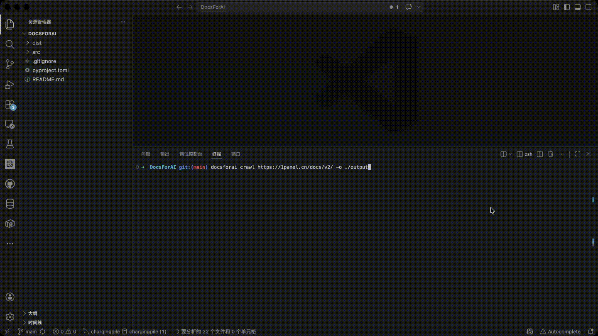

# DocsForAI


> **专为文档网站设计的轻量爬虫，让 AI 可以高质量地阅读任何文档。**

[](https://pypi.org/project/docsforai/)
[](https://python.org)
[](LICENSE)

**中文** | [English](README_EN.md)



DocsForAI 是一个针对常见文档框架深度优化的爬虫工具。它能自动识别 VitePress、Docsify、GitBook 等多种文档站点，按章节结构提取干净的 Markdown 内容，直接输出给 LLM 或向量数据库使用。

---

## 目录

- [DocsForAI](#docsforai)
  - [目录](#目录)
  - [特性](#特性)
  - [安装](#安装)
  - [快速开始](#快速开始)
  - [支持的框架](#支持的框架)
  - [输出格式](#输出格式)
    - [multi-md（默认）](#multi-md默认)
    - [single-md](#single-md)
    - [jsonl](#jsonl)
  - [CLI 参考](#cli-参考)
  - [为什么不用通用爬虫？](#为什么不用通用爬虫)
  - [项目结构](#项目结构)
  - [开发](#开发)
  - [License](#license)

---

## 特性

- 🔍 **自动识别** — 无需手动配置，自动检测 10 种主流文档框架
- 🧹 **内容干净** — 针对每种框架深度定制解析逻辑，去除导航栏、侧边栏、页脚等噪音
- 📁 **多种输出** — 支持多 MD 文件（RAG）、单 MD 文件（LLM 上下文）、JSONL（向量数据库）三种格式
- ⚡ **并发爬取** — 异步 HTTP，可配置并发数和请求间隔
- 🛡️ **反爬绕过** — 内置 Cloudflare 检测，自动回退到系统 `curl`
- 🪶 **轻量依赖** — 仅 5 个运行时依赖

---

## 安装

**要求：** Python 3.10+

```bash
pip install docsforai
```

从源码安装（开发用）：

```bash
git clone https://github.com/dx2331lxz/DocsForAI.git
cd DocsForAI
pip install -e .
```

---

## 快速开始

```bash
# 最简用法：爬取文档，输出为多个 MD 文件（默认）
docsforai crawl https://vitepress.dev/guide -o ./output

# 输出为单一大文件，直接投喂给 LLM
docsforai crawl https://vitepress.dev/guide -f single-md -o ./output

# 输出为 JSONL，适合向量数据库 / 微调数据集
docsforai crawl https://docsify.js.org -f jsonl -o ./output

# 同时导出多种格式
docsforai crawl https://vitepress.dev/guide -f multi-md -f jsonl -o ./output

# 如果自动识别不准确，可以手动指定框架类型
docsforai crawl https://example.com/docs --type vitepress
```

爬取完成后，终端会显示汇总信息：

```
  Detecting site type for https://agpt.co/docs… gitbook

         Crawl summary
┏━━━━━━━━━━━━━━━━━┳━━━━━━━━━┓
┃ Metric          ┃   Value ┃
┡━━━━━━━━━━━━━━━━━╇━━━━━━━━━┩
│ Site            │ AutoGPT │
│ Type            │ gitbook │
│ Pages collected │     174 │
│ Files written   │     174 │
└─────────────────┴─────────┘
  Output    : ./output/autogpt
Done!
```

---

## 支持的框架

DocsForAI 内置如下专用爬虫，全部自动识别，无需配置：

| 框架           | 识别方式                                              | 核心策略                                                         | 测试案例（页数）                    |
| -------------- | ----------------------------------------------------- | ---------------------------------------------------------------- | ----------------------------------- |
| **VitePress**  | `.VPSidebar` CSS 类 / generator meta                  | 解析侧边栏 JSON；提取 `.vp-doc` 区域                             | vitepress.dev                       |
| **Docsify**    | `$docsify` 全局变量                                   | 直接拉取 `.md` 源文件，跳过 HTML 渲染                            | docsify.js.org                      |
| **Mintlify**   | `x-llms-txt` 响应头                                   | 优先读 `llms-full.txt`，一次请求获全量内容                       | mintlify.com/docs                   |
| **Docusaurus** | generator meta / `.theme-doc-sidebar-container`       | 解析侧边栏；提取主内容区                                         | docusaurus.io/docs（92 页）         |
| **mdBook**     | `#mdbook-sidebar` / `ol.chapter`                      | 解析静态 `toc.html` 获取完整章节树                               | rust-lang.github.io/mdBook（31 页） |
| **MkDocs**     | generator meta / `.md-nav--primary` / `#toc-collapse` | 同时支持 Material 和内置默认主题；内置 Cloudflare 绕过           | docs.pydantic.dev（88 页）          |
| **Starlight**  | `#starlight__sidebar` / `.sl-markdown-content`        | 解析 `<details>/<summary>` 分组导航；提取 `[data-pagefind-body]` | starlight.astro.build（35 页）      |
| **GitBook**    | generator meta `GitBook` / `gitbook.com` 脚本         | 通过 `sitemap.xml` 发现所有页面；清除标题锚点图标等噪音          | agpt.co/docs（174 页）              |
| **飞书文档**   | 域名 `open.feishu.cn`                                 | 调用飞书内部 API 拉取目录树和原始 Markdown                       | 飞书开放平台文档                    |
| **Generic**    | 兜底（其他所有站点）                                  | BFS 遍历同域链接；启发式识别主内容区                             | 任意文档站                          |

> 没有找到你需要的框架？欢迎提 [Issue](https://github.com/dx2331lxz/DocsForAI/issues) 或 PR。

---

## 输出格式

### multi-md（默认）

每个页面输出为独立的 `.md` 文件，目录结构与原站保持一致。适合 RAG 检索和按章节管理。
当你指定 `-o ./output` 时，会直接写入 `./output/<site-name>/`，不会再额外创建 `multi-md/` 目录。

```
output/vitepress/
├── guide/
│   ├── getting-started.md
│   └── configuration.md
└── reference/
    └── api.md
```

每个文件包含元信息头：

```markdown
---
title: "Getting Started"
url: "https://example.com/guide/getting-started"
breadcrumb: "Guide > Getting Started"
order: 3
---

# Getting Started
...
```

### single-md

所有页面按章节顺序合并为一个文件，适合直接粘贴到 LLM 对话上下文。
当你指定 `-o ./output` 时，输出文件为 `./output/<site-name>.md`。

### jsonl

每行一条 JSON 记录，适合向量数据库批量导入或微调数据集构建。
当你指定 `-o ./output` 时，输出文件为 `./output/<site-name>.jsonl`。

```json
{"source": "https://...", "title": "Getting Started", "breadcrumb": ["Guide", "Getting Started"], "content": "# Getting Started\n...", "site": "VitePress", "site_type": "vitepress"}
```

---

## CLI 参考

```
docsforai crawl [OPTIONS] URL

参数：
  URL                    目标文档站点 URL（推荐使用首页或文档根路径）

选项：
    -o, --output   PATH    输出根目录 [默认: ./output]
                           multi-md -> <output>/<site-name>/
                           single-md -> <output>/<site-name>.md
                           jsonl -> <output>/<site-name>.jsonl
  -f, --format   FORMAT  导出格式，可重复使用以同时输出多种格式
                           可选值: multi-md | single-md | jsonl  [默认: multi-md]
                           multi-md 会直接输出到 <output>/<site-name>/
  -t, --type     TYPE    强制指定框架类型，跳过自动检测
                         可选值: vitepress | docsify | mintlify | feishu-docs |
                                 docusaurus | mdbook | mkdocs | starlight |
                                 gitbook | generic
  --concurrency  INT     最大并发请求数 [默认: 5]
  --delay        FLOAT   每次请求之间的间隔（秒）[默认: 0.1]
  --timeout      FLOAT   单次 HTTP 请求超时时间（秒）[默认: 30.0]
  --max-pages    INT     最大爬取页数（仅 generic 模式）[默认: 200]
  -V, --version          显示版本号并退出
  --help                 显示帮助信息
```

---

## 为什么不用通用爬虫？

通用爬虫把所有网站一视同仁，而主流文档框架都有可被利用的明确结构约定：

| 场景                | 通用爬虫                | DocsForAI                      |
| ------------------- | ----------------------- | ------------------------------ |
| 导航层级            | ❌ 需要猜测              | ✅ 直接读侧边栏结构             |
| Docsify 原始内容    | ❌ 只能解析渲染后的 HTML | ✅ 直接拉取 `.md` 源文件        |
| Mintlify 全量内容   | ❌ 需要逐页爬取          | ✅ 一次请求读取 `llms-full.txt` |
| 代码块语言标注      | ❌ 常常丢失              | ✅ 完整保留 `language-*` 类名   |
| Cloudflare 防护站点 | ❌ 403 直接失败          | ✅ 自动回退到系统 `curl`        |
| 输出格式            | ❌ 通常只有一种          | ✅ multi-md / single-md / jsonl |

---

## 项目结构

```
src/docsforai/
├── cli.py              # Typer CLI 入口
├── detector.py         # 自动识别站点框架类型
├── converter.py        # HTML → Markdown（保留代码块语言标注）
├── models.py           # 数据模型：DocSite / DocPage / SiteType
├── crawlers/
│   ├── base.py         # 抽象基类（并发控制、限速、curl 回退）
│   ├── vitepress.py
│   ├── docsify.py
│   ├── mintlify.py
│   ├── docusaurus.py
│   ├── mdbook.py
│   ├── mkdocs.py
│   ├── starlight.py
│   ├── gitbook.py
│   ├── feishu.py
│   └── generic.py
└── exporters/
    ├── multi_md.py     # 多 MD 文件导出
    ├── single_md.py    # 单 MD 文件导出
    └── llm.py          # JSONL 导出
```

---

## 开发

```bash
git clone https://github.com/dx2331lxz/DocsForAI.git
cd DocsForAI
pip install -e ".[dev]"
pytest
```

**新增框架支持的步骤：**

1. 在 `models.py` 的 `SiteType` 枚举中添加新类型
2. 在 `crawlers/` 下新建爬虫类，继承 `BaseCrawler`，实现 `crawl()` 方法
3. 在 `detector.py` 中添加识别逻辑（generator meta、特定 CSS/ID 等）
4. 在 `crawlers/__init__.py` 的 `make_crawler()` 工厂函数中注册

---

## License

[MIT](LICENSE)
